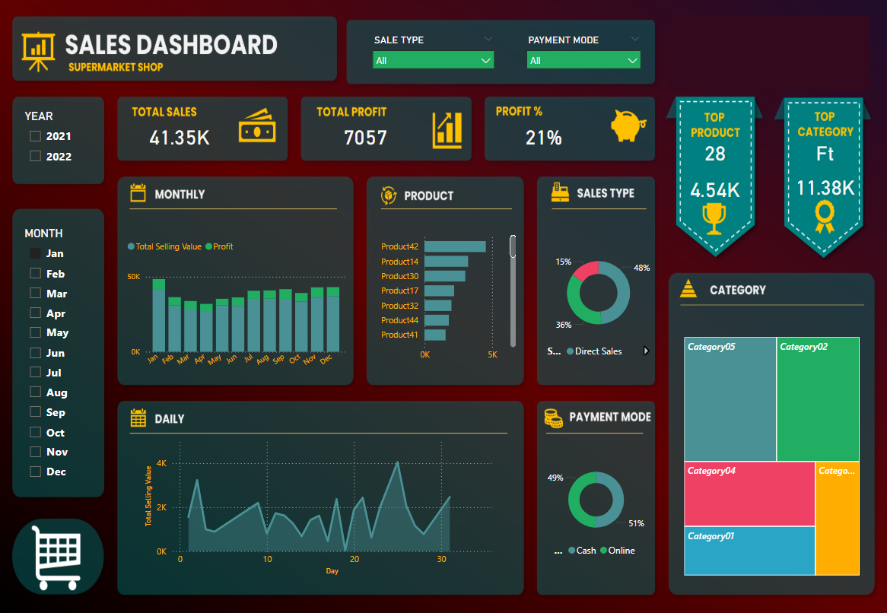
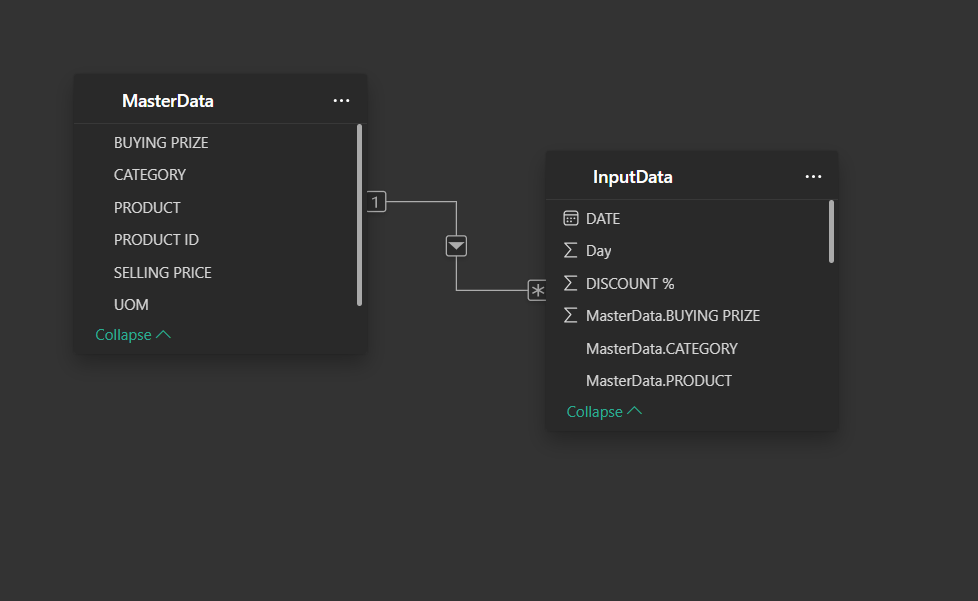

# 📊 Supermarket Sales Dashboard – Power BI Project

---

## 🔍 Overview
This project presents a dynamic and interactive **Sales Dashboard** for a Supermarket shop, designed using **Power BI**. The dashboard enables business stakeholders to track performance metrics like sales, profit, and category insights to make informed decisions.

## 🧠 Objectives

- Visualize total sales and profits over time  
- Identify best-performing product lines and categories  
- Analyze customer purchase behavior by payment methods  
- Provide insights for improving business decisions

## 🛠 Tools & Technologies

- Power BI Desktop  
- Excel (.xlsx) dataset  
- Custom background design (Dashboard UI)

## 📁 Files Included

| File | Description |
|------|-------------|
| `sales.pbix` | Power BI file with visuals and DAX measures |
| `Sales Data.xlsx` | Cleaned dataset used in the dashboard |
| `Background Image.png` | Custom dashboard background image |
| `README.md` | Project documentation |

## 📈 Dashboard Features

- **KPIs**: Total Sales, Total Profit, Profit %, Total Transactions  
- **Visuals**:  
  - Monthly and Daily trends  
  - Product-wise and Category-wise performance  
  - Sales by Payment Type  
  - Top Product and Category indicators  
- **Filters**: Date, Sales Type, Product Line, Payment Mode

## 🏆 Highlights

- Custom-designed UI with a modern retail theme  
- Responsive visuals for stakeholder insights  
- Clean and well-labeled report pages

## 📷 Screenshots

### Dashboard Layout

### Dashboard

### Model View

## 📄 License

This project is licensed under the [MIT License](LICENSE).  
You are free to use, modify, and distribute this project with attribution.
